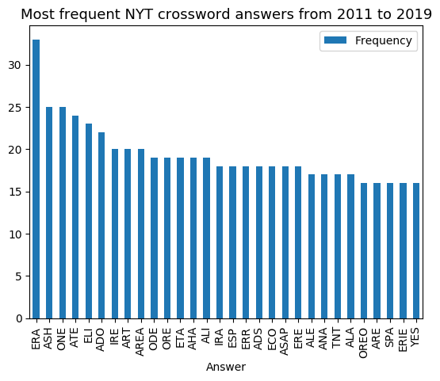

# NYX-Crossword

This is a python script that scrapes [NYXCrosswords.com](https://nyxcrossword.com/) for NYT crossword answers in a given date range. After scraping the data, it collects the most frequent answers and graphs them.

## Graph Generated for 2019

The graphs from 2011 to 2019 can be found [here](./graph.md).

## Setup

1. Setup your virtual environment
    - For mac OS: `python3.7 -m venv env`

2. Activate your virtual environment: 
    - For mac OS: `source ./env/bin/activate`

3. Install requirements.txt: `pip3 install -r requirements.txt`

4. When finished running the script
    - You can deactivate your virtual environment: `deactivate`
    - You can also delete the log files and data directory by running a cleaning script
        - Give execute permissions: `chmod 755 clean.sh`
        - Run script: `./clean.sh` to delete the data directory and any log files generated

Note: You can change the logging level to logging.WARNING, logging.INFO, logging.DEBUG, or logging.ERROR by setting the environment variable (by default is at INFO): `export LOGLEVEL=DEBUG`

## Web Scraping and Analysis

To scrape the website:

- Run `clue_list_scraper.py` script to generate a list of clues and their answers for a given date range: `python3.7 clue_list_scraper.py -s 2019-10-01 -e 2019-10-31 -l october.log`
  - You can run the script with the same start and end date it will scrape the clues for that day:
    - Give execute permissions: `chmod 755 scrape-day.sh`
    - Run script: `./scrape-day.sh 2019-01-01`
  - You can run the script for all the crosswords in a given year:
    - Give execute permissions: `chmod 755 scrape-year.sh`
    - Run script: `./scrape-year.sh 2019`
- *Must run with python 3.7 or later*, if not the command line argument will not parse correctly as described [here](https://stackoverflow.com/questions/25470844/specify-format-for-input-arguments-argparse-python/25470943)

To analyze the results:

- The csv file with the clue list be found in `./data/crossword-clues-from-2019-10-01-to-2019-10-31.csv`
- You can run `analysis.py` to find the most common crossword counts from a given date range which produces a csv called `./data/crossword-clues-frequency-from-2019-10-01-to-2019-10-31.csv`
- You can run `graph.py` to make a graph of the results of the frequencies and it will be found in `most-frequent-nyt-crossword-answers-from-2019-10-01-to-2019-10-31.png`
- `merge.py` takes all the frequency csvs in /data and aggregates the answer counts then creates a graph
